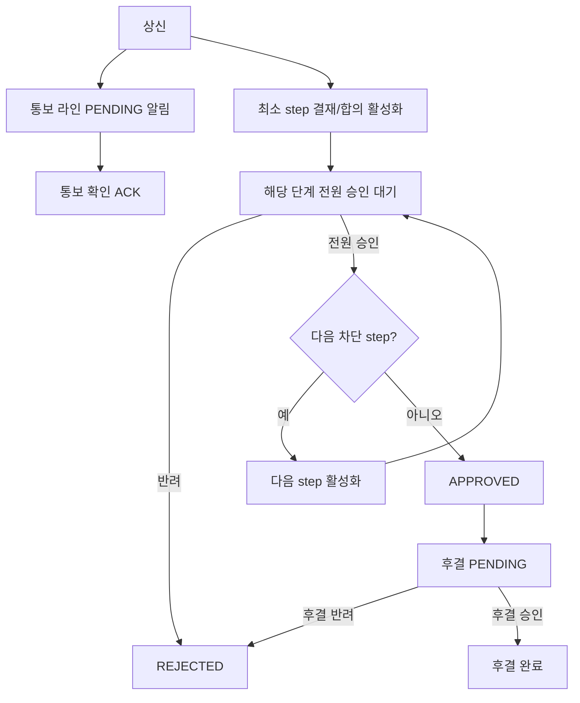

# 결재 기능 정의서 (v1.1)

| 항목 | 내용 |
|------|------|
| 문서 버전 | 1.1 |
| 작성일 | 2026-07-20 |
| 대상 시스템 | miniproject (Vue 3 + Spring Boot) |
| 상태 | **확정** (구현 기준) |

---

## 1. 목적

사내(또는 조직)에서 **전자 기안 → 결재/합의/후결/통보 → 완료/반려** 흐름을 제공하고,  
**순차·병렬 결재선**과 **순서 변경**을 지원하며,  
기존 **사용자·Role·메뉴 권한·첨부·다국어** 체계와 연동한다.

---

## 1.1 정책 확정 사항

| 항목 | 확정 |
|------|------|
| 기안 작성 형태 | **제목 + 내용(본문) + 첨부** (공통 폼). 유형별 전용 폼 없음 |
| 자기결재 | **불허** (기안자 = 결재/합의/후결/통보 대상자 지정 불가) |
| 반려 후 | **새 기안만** (동일 문서 재상신 없음). 반려 문서는 조회만 |
| 후결 대기함 노출 | **상신 직후** (`IN_PROGRESS`/`APPROVED` + 내 POST `PENDING`) |
| 상신 후 결재선 수정 | **불가** (활성·미래 단계 모두). 순서는 **기안 작성 시에만** 변경 |
| 후결 반려 | 문서 **`REJECTED`** (이미 승인 완료여도 전환) |
| 통보 시점 | **상신 즉시** |
| 통보 확인 | **수동 확인(ACK)** |
| 결재·합의 순서 변경 | **기안 작성(DRAFT) UI**에서 결재자·합의자 순서 변경 |
---

## 2. 1차 범위 (MVP+)

### 2.1 포함

| ID | 기능 | 설명 |
|----|------|------|
| A-01 | 기안 작성 | **제목, 내용, 첨부**, 결재선 구성 후 상신 |
| A-02 | 임시저장 | 상신 전 DRAFT 상태로 저장·수정·삭제 |
| A-03 | 결재선 구성 | 결재 / 합의 / 후결 / 통보 + 단계(순서) + 대상자 지정 |
| A-04 | 병렬 단계 | **동일 `step_order`** 에 여러 명 → 동시 대기(병렬) |
| A-05 | 순차 단계 | `step_order` 가 다르면 낮은 단계 완료 후 다음 단계 활성화 |
| A-06 | 합의 | 유형 `AGREE`. 같은 단계 내 **전원 승인** 해야 다음 단계로 진행 |
| A-07 | 결재 | 유형 `APPROVE`. 순차·병렬 모두 지원. 병렬 시 해당 단계 전원 승인 필요 |
| A-08 | 후결 | 유형 `POST`. **진행을 막지 않음**. 상신 직후 대기함 노출 |
| A-08b | 통보 | 유형 `NOTIFY`. **진행 비차단·반려 없음**. 상신 즉시 통보, 확인(ACK) |
| A-09 | 결재·합의 순서 변경 | **기안 작성(DRAFT) 시**에만 결재자·합의자 순서를 변경(↑↓/드래그). 상신 후에는 변경 불가 |
| A-10 | 상신 | DRAFT → IN_PROGRESS |
| A-11 | 승인 | 내 차례 결재/합의/후결만 |
| A-12 | 반려 | 결재/합의/후결 → `REJECTED`. 이후 **새 문서로만** 재기안 |
| A-12b | 통보 확인 | `ACKNOWLEDGED` |
| A-13 | 회수 | 처리 완료 라인 0건일 때만 → DRAFT |
| A-14 | 조회함 | 대기함 / 기안함 / 통보함 / 관련 문서함 |
| A-15 | 상세 조회 | 본문, 첨부, 결재선, 이력 |
| A-16 | 권한 | 메뉴 권한 + 문서 단위 접근 제어 |
| A-17 | 알림(최소) | 상신·내 차례·반려·완료·후결·통보 뱃지 |

### 2.2 제외 (후속)

- 전결, 대결, 위임
- 결재선 템플릿·조직도 자동 지정
- 문서 유형별 전용 폼, 동일 문서 재상신
- 자기결재
- 상신 후 본문 수정, **상신 후 결재선(순서·인원) 변경**
- 전자서명·도장, ERP 연동, 통보 독촉

---

## 3. 결재선 유형 정의

| 유형 코드 | 화면명 | 진행 차단 | 승인/반려 | 병렬(동 step) | 완료 조건 | 비고 |
|-----------|--------|-----------|-----------|---------------|-----------|------|
| `APPROVE` | 결재 | 예 | 승인/반려 | 가능 | 동 step APPROVE **전원 APPROVED** | 일반 결재 |
| `AGREE` | 합의 | 예 | 승인/반려 | 가능(권장) | 동 step AGREE **전원 APPROVED** | 1명 반려 → 문서 반려 |
| `POST` | 후결 | **아니오** | 승인/반려 | 가능 | 개별 처리(문서 완료와 무관) | 미완이어도 `APPROVED` 가능 |
| `NOTIFY` | 통보 | **아니오** | **확인만** (반려 없음) | 가능 | 개별 `ACKNOWLEDGED` (미확인이어도 문서 진행·완료 가능) | 참조/공유 성격 |

### 3.1 단계(step)와 병렬

- 결재선은 **라인(개인 단위)** 과 **단계(`step_order`)** 로 구성한다.
- **같은 `step_order`** = 한 단계(병렬 그룹). 그룹 안 인원은 동시에 `PENDING`(또는 후결은 정책에 따라 `WAITING`).
- **`step_order` 오름차순**으로 진행한다.  
  다음 단계 활성화 조건: **직전 단계의 차단 유형(APPROVE/AGREE)이 모두 완료**.
- 한 단계에 APPROVE와 AGREE를 **섞지 않는다** (검증).  
  POST·NOTIFY는 차단 유형과 **같은 step에 섞지 않는 것**을 권장(검증 권장: 동일 step에 APPROVE/AGREE와 POST/NOTIFY 혼재 금지).
- **권장 배치:** 결재/합의 단계들 → (선택) 후결 → (선택) 통보.  
  통보는 `step_order` 를 맨 뒤 그룹으로 두거나, 표시용 순서만 두고 엔진에서는 항상 비차단 처리.

### 3.2 후결(POST) 상세

1. 상신 후, **최소 step의 APPROVE/AGREE** 만 먼저 활성화한다. POST는 “후결 대기”로 두되 **문서 진행을 막지 않는다**.
2. 모든 APPROVE/AGREE 라인이 승인되면 문서 상태 = `APPROVED` (이 시점에 POST·NOTIFY가 남아 있어도 됨).
3. POST 라인은 `APPROVED` 이후에도 `PENDING` 유지 → 후결자가 승인하면 해당 라인만 `APPROVED`.
4. POST **반려** 시 문서 → `REJECTED` (**확정**. 이미 `APPROVED` 여도 전환). 이력에 후결 반려 명시.
5. **후결 대기함 (확정):** 상신 직후부터 — 문서가 `IN_PROGRESS` 또는 `APPROVED` 이고 내 POST가 `PENDING`.

### 3.3 통보(NOTIFY) 상세

1. **의미:** 결재 권한이 아닌 **열람·공유(참조)**. 문서 진행/완료를 막지 않고, **반려·승인 개념 없음**.
2. **상신 시** 통보 라인 → `PENDING`(미확인). 통보함·알림에 노출.
3. 수신자 액션: **확인** (`ACK`) → 라인 `ACKNOWLEDGED`, `acted_at` 기록. 의견(comment) 선택.
4. 미확인이어도 결재/합의 진행 및 문서 `APPROVED`/`REJECTED` 가능.
5. 문서가 `REJECTED`·회수되어도 통보 이력은 보존. 회수 시 미확인 NOTIFY는 `SKIPPED` 가능.
6. **통보 시점 (확정):** 상신 즉시.
7. 통보자는 상세 조회 가능. 승인/반려 없음, **확인**만. (자동 확인 없음)
8. **통보함** (`/approval/notices`) — 내 NOTIFY 미확인/전체.

### 3.4 합의 vs 병렬 결재 vs 후결 vs 통보

| | 결재 `APPROVE` | 합의 `AGREE` | 후결 `POST` | 통보 `NOTIFY` |
|--|----------------|--------------|-------------|---------------|
| 진행 차단 | 예 | 예 | 아니오 | 아니오 |
| 주 액션 | 승인/반려 | 승인/반려 | 승인/반려 | **확인만** |
| 미처리 시 문서 완료 | 불가 | 불가 | 가능 | 가능 |
| UX 배지 | 결재 | 합의 | 후결 | 통보 |

---

## 4. 결재·합의 순서 변경 (기안 작성 시)

> **범위 명확화:** “순서 변경”은 상신 후 결재선 재편집이 아니라,  
> **기안을 작성할 때** 결재자·합의자의 **처리 순서(`step_order`)를 바꾸는 것**이다.

### 4.1 DRAFT (기안 작성·임시저장 화면)

- 결재(`APPROVE`)·합의(`AGREE`) 라인을 추가/삭제하고, **↑↓ 또는 드래그로 순서 변경**.
- 순서 = 엔진의 `step_order` (앞선 순서부터 활성화).  
  - 서로 다른 순서 → **순차**  
  - 같은 순서로 묶기 → **병렬**
- 후결·통보도 기안 화면에서 지정·표시 순서는 바꿀 수 있으나, 엔진상 비차단이라 **진행 순서에는 영향 없음**.
- 저장/상신 시 결재선 전체를 함께 저장한다.

### 4.2 상신 이후

- 결재선 **순서·인원·유형 변경 불가** (확정).
- 기안자는 회수(미처리 시) 후 DRAFT에서만 다시 순서를 조정할 수 있다.

---

## 5. 사용자·역할

| 역할 | 주요 행위 |
|------|-----------|
| 기안자 | 작성, **기안 시** 결재/합의 순서·결재선 편집, 상신, 회수 |
| 결재자(APPROVE) | 활성 단계 승인/반려 |
| 합의자(AGREE) | 활성 단계 승인/반려 |
| 후결자(POST) | 후결 승인/반려 (진행 비차단) |
| 통보 수신자(NOTIFY) | 열람·**확인** (승인/반려 없음) |
| 관리자 | 메뉴·유형 시드/권한 |

접근: **기안자 + 결재선에 포함된 사용자(통보 포함)** 만 상세 조회 (MVP).

---

## 6. 문서 상태

```text
DRAFT         임시저장
IN_PROGRESS   결재/합의 진행 중 (후결·통보 미완과 공존 가능)
APPROVED      차단 단계 모두 승인 — 후결/통보 미완 가능
REJECTED      반려 확정. **재상신 불가** → 필요 시 새 기안
```

UI 보조 표시(상태 필드 아님): `후결 대기 N건`, `통보 미확인 N건` 뱃지.

### 상태 전이

| From | To | 행위 | 조건 |
|------|-----|------|------|
| — | DRAFT | 저장 | 기안자 |
| DRAFT | IN_PROGRESS | 상신 | 결재선에 APPROVE 또는 AGREE ≥ 1 (NOTIFY만으로 상신 불가) |
| DRAFT | 삭제 | 삭제 | 기안자 |
| IN_PROGRESS | IN_PROGRESS | 승인 | 활성 라인; 단계 미완료면 상태 유지 |
| IN_PROGRESS | APPROVED | 승인 | 모든 APPROVE/AGREE 완료 |
| IN_PROGRESS / APPROVED | REJECTED | 반려 | 내 PENDING 라인(결재/합의/후결) |
| IN_PROGRESS | DRAFT | 회수 | 처리 완료 라인 0건 |
| APPROVED | APPROVED | 후결 승인 | POST 라인만 갱신 |
| * | * (문서 상태 불변) | 통보 확인 | NOTIFY → `ACKNOWLEDGED` |

---

## 7. 진행 엔진 규칙 (요약)

1. 상신 시: `min(step_order)` 중 APPROVE/AGREE → `PENDING` 활성화.  
   POST·NOTIFY → `PENDING`(대기)이나 **단계 완료 조건에서 제외**.
2. 단계 완료: 해당 `step_order` 의 APPROVE·AGREE 가 모두 `APPROVED`.
3. 단계 완료 시: 다음 차단 step 활성화. POST/NOTIFY만 있는 step은 진행 계산에서 스킵.
4. 차단 라인 전부 `APPROVED` → 문서 `APPROVED`.
5. APPROVE/AGREE/POST 의 PENDING에서 반려 → 문서 `REJECTED`, 나머지 PENDING → `SKIPPED`.  
   NOTIFY는 반려 API 호출 불가.
6. 함 구분:  
   - **대기함:** APPROVE/AGREE 활성 PENDING, 또는 POST PENDING  
   - **통보함:** NOTIFY + PENDING(미확인)



---

## 8. 화면 구성

| 화면 | 경로(안) | 설명 |
|------|----------|------|
| 대기함 | `/approval/inbox` | 내 차례(결재/합의/후결) |
| 통보함 | `/approval/notices` | 내게 온 통보(미확인/전체) |
| 기안함 | `/approval/drafts` | DRAFT + 내가 올린 문서 |
| 문서함 | `/approval/documents` | 관련 문서 검색 |
| 작성/수정 | `/approval/documents/new`, `.../:id/edit` | 제목·내용·첨부 + 결재선(결재/합의 **순서 변경**) |
| 상세 | `/approval/documents/:id` | 조회·승인/반려/확인 (결재선 수정 없음) |

### 결재선 빌더 UX (기안 작성 시)

- 행: 유형(결재/합의/후결/통보) | 사용자 | **순서(↑↓/드래그)** | 병렬 묶기
- 결재·합의 행의 순서가 곧 처리 순서
- 같은 순번으로 묶으면 병렬
- 후결·통보: “진행 비차단” 안내

---

## 9. 데이터 모델 (초안)

### 9.1 `pjt_approval_documents`

| 컬럼 | 설명 |
|------|------|
| id | PK |
| doc_no | `AP-YYYYMMDD-####` |
| title | 제목 (필수) |
| content | 내용/본문 (텍스트, 필수) |
| status | DRAFT / IN_PROGRESS / APPROVED / REJECTED |
| current_step | 현재 활성 차단 단계 `step_order` (없으면 null) |
| version | 낙관적 잠금 |
| drafter_id | |
| submitted_at, completed_at | |
| created_at, updated_at | |

> `doc_type` 컬럼은 1차에 두지 않거나 `GENERAL` 고정. 유형별 폼은 후속.  
> 첨부는 기존 파일 모듈 `ref_type=APPROVAL_DOCUMENT` 로 연결 (**1차 포함**).

### 9.2 `pjt_approval_lines`

| 컬럼 | 설명 |
|------|------|
| id | PK |
| document_id | FK |
| step_order | 단계(동일 값 = 병렬) |
| sort_in_step | 단계 내 표시 순서 |
| line_type | `APPROVE` / `AGREE` / `POST` / `NOTIFY` |
| approver_id | 대상 사용자 (통보 수신자 포함) |
| status | WAITING / PENDING / APPROVED / REJECTED / ACKNOWLEDGED / SKIPPED |
| acted_at, comment | |
| active | 차단 유형의 현재 처리 가능 여부 |

- `WAITING`: 아직 도래하지 않은 차단 단계  
- `PENDING`: 처리·확인 대기 (결재/합의/후결/통보)  
- `ACKNOWLEDGED`: 통보 확인 완료  
- POST·NOTIFY는 상신 후 `PENDING` 가능, 단계 완료 산정에서 제외  

### 9.3 `pjt_approval_histories`

| action 예 |
|-----------|
| CREATE, UPDATE, SUBMIT, APPROVE, REJECT, ACK, RECALL, DELETE |

---

## 10. API (초안)

| Method | Path | 설명 |
|--------|------|------|
| GET/POST/PUT/DELETE | `/api/approval/documents` … | 목록·생성·수정·삭제·상세 |
| PUT | `/api/approval/documents/{id}` | DRAFT만: 제목·내용·**결재선(순서 포함)** 저장 |
| PUT | `/api/approval/documents/{id}/lines` | DRAFT만: 결재선 전체 치환(결재/합의 순서·병렬) |
| POST | `/api/approval/documents/{id}/submit` | 상신 (이후 결재선 변경 API 거부) |
| POST | `/api/approval/documents/{id}/recall` | 회수 |
| POST | `/api/approval/documents/{id}/approve` | `{ lineId, comment? }` — APPROVE/AGREE/POST |
| POST | `/api/approval/documents/{id}/reject` | `{ lineId, comment }` — APPROVE/AGREE/POST (NOTIFY 불가) |
| POST | `/api/approval/documents/{id}/acknowledge` | `{ lineId, comment? }` — **NOTIFY 확인** |
| GET | `/api/approval/inbox` | 결재/합의/후결 PENDING |
| GET | `/api/approval/notices` | 통보 PENDING/전체 |

---

## 11. 비즈니스 규칙·검증

1. 상신 시: **제목·내용** 필수, 첨부 선택, **APPROVE 또는 AGREE ≥ 1**.
2. **자기결재 불허:** 기안자 ID가 결재선(APPROVE/AGREE/POST/NOTIFY) 어느 라인의 `approver_id`에도 올 수 없음.
3. 동일 `step_order` 에 APPROVE와 AGREE 혼재 금지. 차단 유형과 POST/NOTIFY 혼재 금지.
4. 동일 문서에 같은 `approver_id` 중복 지정 금지.
5. 반려 시 comment 필수. `REJECTED` 문서는 submit 불가 → **새 문서 기안**만 가능.
6. NOTIFY에 approve/reject → 400. acknowledge만 허용.
7. 후결 반려 → 문서 `REJECTED` (확정).
8. **상신 후** 결재선(순서·인원·유형) 변경 시도 → 400. 순서는 **기안(DRAFT) 작성 시에만**.
9. 동시성: `version` 또는 line PENDING 조건 갱신.
10. 비활성 사용자 신규 지정 불가.

---

## 12. 수용 기준

- [ ] 제목·내용·첨부로 기안/임시저장/상신
- [ ] 자기결재 지정 시 검증 실패
- [ ] 순차·병렬 결재/합의, 후결·통보 규칙 준수
- [ ] 후결 상신 직후 대기함 노출
- [ ] 후결 반려 시 REJECTED
- [ ] REJECTED 문서 재상신 불가, 새 기안만 가능
- [ ] 기안 작성 화면에서 결재자·합의자 순서 변경·병렬 묶기 후 상신 반영
- [ ] 상신 후 결재선 수정 API/UI 없음
- [ ] 통보함·ACK, 관련자 외 403

---

## 13. (폐쇄) 과거 Open Questions

| # | 질문 | 확정 |
|---|------|------|
| 1 | 기안 형태 | 제목 + 내용 + 첨부 |
| 2 | 자기결재 | 불허 |
| 3 | 반려 후 | 새 기안 |
| 4 | 후결 선조회 | 상신 직후 |
| 5 | 상신 후 결재선 수정 | **불가** (기안 시에만 결재·합의 순서 변경) |
| 6 | 후결 반려 | REJECTED |
| 7 | 통보 시점 | 상신 즉시 |
| 8 | 통보 확인 | 수동 ACK |
| 9 | 순서 변경 의미 | **기안 작성 시** 결재자·합의자 순서 |

---

## 14. 구현 단계

1. Liquibase + 첨부 연동 + 메뉴·i18n  
2. 결재 엔진 (병렬·합의·후결·통보·자기결재 검증)  
3. API  
4. 기안 UI (제목/내용/첨부 + 결재·합의 **순서** 빌더)  
5. 대기함·통보함·상세  
6. 동시성·이력·반려 후 새기안 UX  

---

## 15. 변경 이력

| 버전 | 일자 | 내용 |
|------|------|------|
| 0.1 | 2026-07-20 | 초안 (순차 결재만) |
| 0.2 | 2026-07-20 | 합의·병렬·후결·순서 변경 |
| 0.3 | 2026-07-20 | 통보(`NOTIFY`) |
| 1.0 | 2026-07-20 | 정책 확정 |
| 1.1 | 2026-07-20 | 순서 변경 = 기안 시 결재·합의 순서만 (상신 후 변경 제외) |
